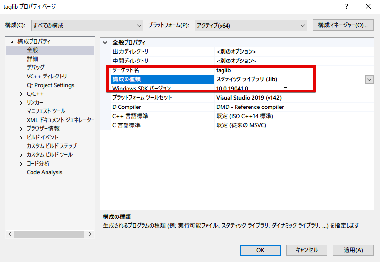
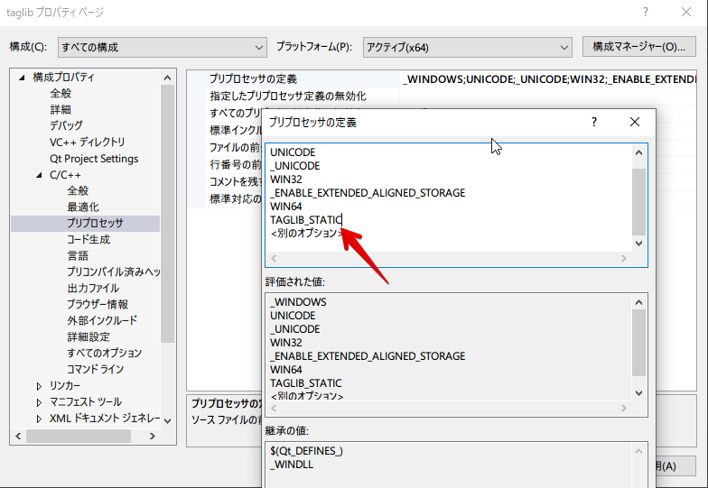
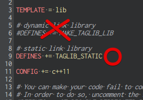

# TagLib for Windows

音楽ファイルのタグを扱うライブラリ[TagLib](https://taglib.org)を
QtCrearor、MSVCで組み込めるようにしたプロジェクト一式です。

### 変更点
- 山括弧(<>) は廃止、全て二重引用符("")に変更
- インクルードパスをtaglibを起点としたパスに変更
- 3rdpartyフォルダの場所を移動
- cmake類等、プログラム動作に関係ないファイルはオミット

### 静的リンクについて

プロジェクトは動的リンクの設定になっているので静的リンクにしたい場合は変更が必要

- MSVCの場合
  - 全般>構成の種類をスタティックライブラリに変更
  
  
  - C/C++>プリプロセッサ>プリプロセッサの定義から`TAGLIB_STATIC`を定義する
  
  

- QtCreatorの場合
  - MAKE_TAGLIB_LIBの方を無効にしてTAGLIB_STATICの方を有効にする
  
  

### ライセンス
- [MPL 1.1](COPYING.MPL)
- [LGPL 2.1](COPYING.LGPL)
